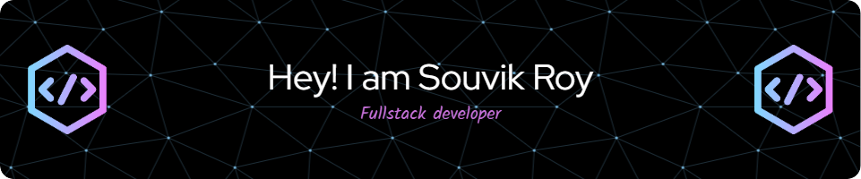

<h1 align="center">Hi 👋, I'm Souvik Roy</h1>

<h3 align="center">A passionate software developer from India available for jobs.</h3>

  

- 👨‍💻 All of my projects are available at [https://souvik-portfolio.vercel.app/](https://souvik-portfolio.vercel.app/)

- 💬 Ask me about **React , Nextjs , Spring Boot ,Nodejs**

- 📫 How to reach me **souvikroy1999ab@gmail.com**

- 📄 Know about my experiences [https://souvik-portfolio.vercel.app/](https://souvik-portfolio.vercel.app/)

- ⚡ Fun fact **I am available for freelancing**

<h3 align="left">Connect with me:</h3>

<h3 align="left">Languages and Tools:</h3>

 
                    

<h3 align="left">Support:</h3>

  
 
<!-- 

<!-- 
&nbsp;

 -->
